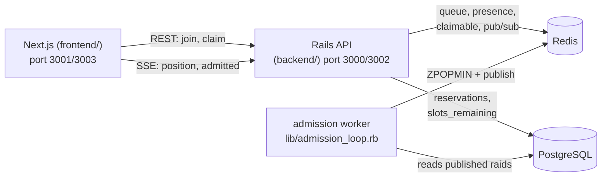

# Chapter 1: Basics & Architecture

This repo is a **virtual waiting-queue and reservation system for high-demand Pokémon GO raid
lobbies** — the same shape of problem as buying concert tickets: millions want in, only a handful
of slots exist, and the system must hand them out *fairly* without ever handing out the same slot
twice. This chapter gives you the four ideas you need in your head before reading any code, a tour
of the repo, and a picture of what actually runs when you start the app.

If you want the project's own framing, the non-negotiable design rules live in
[`.specify/memory/constitution.md`](../.specify/memory/constitution.md), and the run instructions
are in [`README.md`](../README.md). The codebase was built spec-first with
[spec-kit](https://github.com/github/spec-kit); each feature has a folder under
[`specs/`](../specs/).

## The four concepts

Everything in this codebase is in service of these four ideas. Hold them and the rest falls out.

**1. Two stores, two jobs.** PostgreSQL is the durable *system of record* — it holds raids,
trainers, and reservations, and it is the only thing that enforces "never oversell." Redis is
*ephemeral coordination* — the waiting line, who's been admitted, reconnect tokens, live counters,
and pub/sub. Lose Redis and you lose people's *positions in line*; you never lose a confirmed
*reservation*. That split is deliberate and shows up everywhere.

**2. The waiting line is a Redis sorted set.** Each raid's queue is a `ZSET` scored by a
strictly-increasing sequence number, so ordering is exact FIFO and every operation
(`ZADD`/`ZRANK`/`ZPOPMIN`) is O(log N) even with millions of members. Chapter 2 lives here.

**3. No-oversell is a hard database invariant, not application etiquette.** A raid lobby must
*never* confirm more reservations than it has slots. This is enforced by a single Postgres
transaction plus `CHECK` constraints — not by a Ruby `if`. Chapter 3 is entirely about this.

**4. Control plane vs. data plane.** A background *admission worker* decides who gets let in and
how fast. The *booking path* (claiming a slot) must never block on it. If the worker dies,
reservations stay correct; only the flow of new admissions pauses. This separation is why the
worker is a separate process, not a method call.

## The stack

From [`backend/Gemfile`](../backend/Gemfile) and [`frontend/package.json`](../frontend/package.json):

| Layer | Choice | Why |
|-------|--------|-----|
| API | Rails 8.1 (`--api`) | Fast to stand up; ActiveRecord gives transactional integrity for the invariant |
| Queue/coordination | Redis 7 (`redis` + `connection_pool`) | Sorted sets + atomic ops + pub/sub in one box |
| System of record | PostgreSQL 16 (local dev: 14) | Durable truth; `CHECK` constraints back the invariant |
| Frontend | Next.js 14 (App Router) + React 18 | Server components for lists, client components for the live waiting room |
| Worker | A plain Rails process (`bin/rails admission:run`) | Control-plane isolation without a job-queue dependency |

## Repo layout

```
backend/          Rails API
  app/models/         Raid, Trainer, Reservation, Encounter
  app/services/       the real logic — raid_queue/, reservations/, encounters/, admission/
  app/controllers/    thin HTTP/SSE adapters over the services
  lib/admission_loop.rb + lib/tasks/   the worker + rake tasks (sim, admission)
  sim/                fiber-based load simulator
  spec/               RSpec: services/, requests/, integration/
frontend/         Next.js app (app/, lib/)
specs/            spec-kit artifacts: 001-raid-lobby-queue, 002-elastic-encounters
.specify/memory/constitution.md   the design rules
docker-compose.yml + infra/       local run; deferred AWS
```

The thing to internalize: **the logic lives in `app/services/`, not in controllers or models.**
Controllers parse params and map results to HTTP status codes; models are thin. A service object
like [`Reservations::Claim`](../backend/app/services/reservations/claim.rb) is where the
interesting work happens. This is what makes the core testable without HTTP (Chapter 6).

## What runs when the app runs

Five processes cooperate. The booking path touches only three of them; the worker is off to the
side.



Caption: notice the worker only touches Redis + reads raids — it never sits in the claim path
between the frontend and Postgres. That is concept #4 made physical.

A single trainer's happy path, end to end:

1. Frontend `POST /raids/:id/queue/join` → [`RaidQueue::Join`](../backend/app/services/raid_queue/join.rb)
   adds them to the Redis sorted set and mints a reconnect token.
2. Frontend opens an SSE stream; [`QueueStreamsController`](../backend/app/controllers/queue_streams_controller.rb)
   pushes live position.
3. The worker's loop ([`lib/admission_loop.rb:28`](../backend/lib/admission_loop.rb#L28)) pops the
   next batch off the line and publishes an `admitted` event.
4. The frontend flips to a Claim button; `POST /raids/:id/reservations` runs
   [`Reservations::Claim`](../backend/app/services/reservations/claim.rb) — the atomic, no-oversell
   transaction.

## Running it

Two ways. Local dev assumes **Ruby 3.2 via rbenv** and a running Postgres + Redis (the `bin/rails`
wrapper picks up the pinned Ruby automatically). All backend commands run from `backend/`:

```bash
cd backend
bin/rails db:prepare db:seed          # create + migrate + seed one raid
bin/rails server -p 3000              # the API
bin/rails admission:run               # the worker (separate terminal)
```

Frontend (Node 20+), from `frontend/`:

```bash
NEXT_PUBLIC_API_BASE=http://localhost:3000 npm run dev   # serves on 3001
```

Or the whole stack in containers: `docker compose up --build` (Chapter 8 covers why the ports and
tuning matter). Tests, which need a wide DB pool for the concurrency specs:

```bash
cd backend && RAILS_MAX_THREADS=60 bundle exec rspec
```

## Try it out

Try each step yourself first — expand the solution only when stuck.

1. List every service object in the codebase and group them by subsystem. Which directory has the
   most, and what does that tell you about where the complexity lives?

   <details>
   <summary><b>Solution</b></summary>

   ```bash
   cd backend && find app/services -name '*.rb' | sort
   ```

   You'll see `raid_queue/` (join, position, admit_batch, reconnect), `reservations/` (claim),
   `encounters/` (join, position, admit_batch, reconnect), `admission/` (pacing), plus
   `service_result.rb` and `queue_redis.rb`. The queue subsystems dominate — confirming the
   "logic lives in services" point and that queueing/admission is the heart, not CRUD.
   </details>

2. Find where the seed data comes from and change the sample raid's capacity, then re-seed.

   <details>
   <summary><b>Solution</b></summary>

   Edit [`backend/db/seeds.rb`](../backend/db/seeds.rb), change `r.capacity = 20` and
   `r.slots_remaining = 20` to `40`, then:

   ```bash
   cd backend && bin/rails db:seed && bin/rails runner 'pp Raid.last.slice(:boss, :capacity, :slots_remaining)'
   ```

   Expected: the printed hash shows `capacity: 40`. Note seeds are idempotent (`find_or_create_by!`),
   so editing an existing raid's capacity needs a fresh DB or a manual update — a small reminder
   that `slots_remaining` is the live invariant carrier (Chapter 3).
   </details>

3. Trace the four concepts in the constitution. Open the constitution and match each "NON-NEGOTIABLE"
   principle to one of the four concepts above.

   <details>
   <summary><b>Solution</b></summary>

   ```bash
   grep -n 'NON-NEGOTIABLE' .specify/memory/constitution.md
   ```

   Principle I (Fairness) → concept 2; Principle II (Capacity Correctness) → concept 3; Principle
   VI (Test-First) is the testing discipline (Chapter 6). Concept 4 maps to Principle III. The
   constitution is the "why" behind every design choice you'll read next.
   </details>

Next up: Chapter 2 opens the data plane's front door — the Redis sorted set that *is* the waiting
line — and shows how a five-line `Join` service gives you strict FIFO, idempotent re-joins, and the
reconnect grace window for free.
