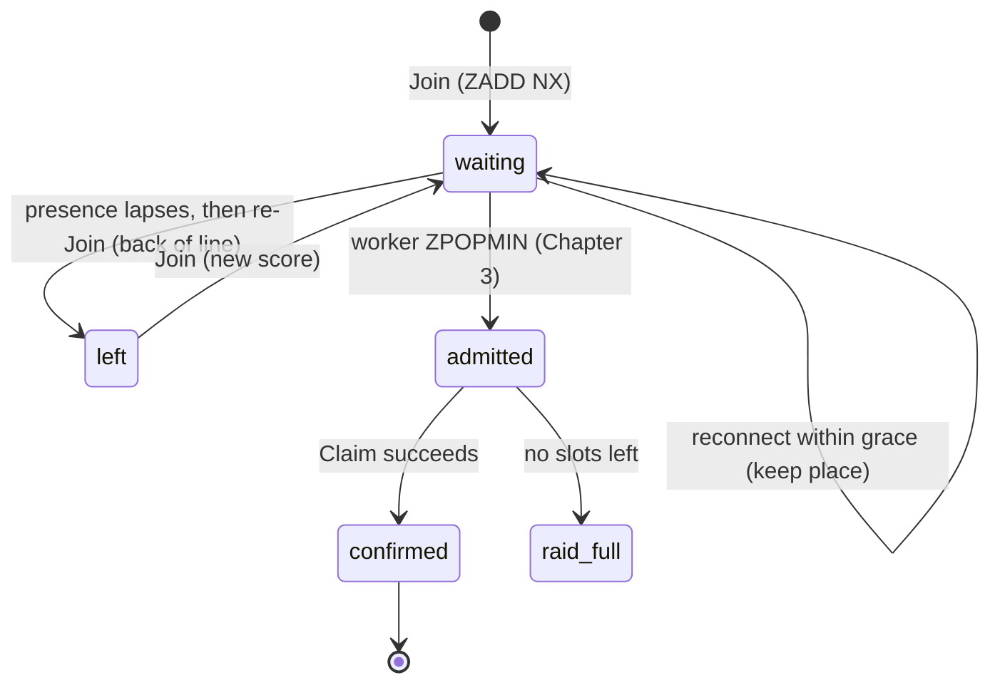

# Chapter 2: The FIFO Queue

The waiting line is the data plane's front door, and it's almost entirely a single Redis sorted
set. This chapter walks
[`RaidQueue::Join`](../backend/app/services/raid_queue/join.rb) line by line, because that one
service quietly delivers four things at once: strict FIFO order, idempotent re-joins, a
reconnect-grace window, and O(log N) position lookups. Get this and you understand concept #2 from
Chapter 1.

## Why a sorted set, and why the score is a counter

A Redis sorted set (`ZSET`) keeps members ordered by a numeric *score*. We use it as the line:
member = the trainer's id, score = their place. The interesting decision is **what the score is.**

The source article this project is based on used a wall-clock timestamp. This codebase uses a
strictly-increasing per-raid counter (`INCR seq:{raidId}`) instead:

```ruby
# backend/app/services/raid_queue/join.rb:44
score = r.incr(QueueConfig.seq_key(@raid.id))
r.zadd(qkey, score, member, nx: true)
```

| Score source | FIFO guarantee | Failure mode |
|--------------|----------------|--------------|
| `INCR` counter (chosen) | Total, unique ordering — no two trainers ever tie | None for ordering |
| Wall-clock timestamp | Approximate | Two joins in the same millisecond tie; clock skew across servers can reorder |

For a system whose entire promise is fairness, "two people can tie and we pick arbitrarily" is a
correctness bug, not a rounding error. The counter costs one extra `INCR` and removes the failure
mode. The keys themselves are defined in one place,
[`config/initializers/queue_config.rb`](../backend/config/initializers/queue_config.rb#L16) — every
Redis key in the app is a method there, so there's a single source of truth for the keyspace.

## The Join service, end to end

```ruby
# backend/app/services/raid_queue/join.rb:26
def call
  return ServiceResult.failure(code: :not_published) unless @raid.published?
  return ServiceResult.failure(code: :raid_full) if @raid.full?

  QueueRedis.with do |r|
    member = @trainer.id.to_s
    qkey = QueueConfig.queue_key(@raid.id)
    existing_score = r.zscore(qkey, member)
    present = r.exists?(QueueConfig.presence_key(@raid.id, member))

    if existing_score && !present          # gone past grace → back of the line
      r.zrem(qkey, member)
      existing_score = nil
    end

    if existing_score.nil?
      score = r.incr(QueueConfig.seq_key(@raid.id))
      r.zadd(qkey, score, member, nx: true)  # NX: don't move an existing waiter
    end

    touch_presence(r, member)
    token = mint_token(r, member)
    position = rank_to_position(r.zrank(qkey, member))
    depth = r.zcard(qkey)
    ServiceResult.success(token: token, state: "waiting", position: position, depth: depth)
  end
end
```

Three subtle things are happening:

- **Idempotent join.** `ZADD ... NX` only sets a score if the member is absent. A double-tapped
  "Join" button or a retried request never moves someone who's already in line. The `existing_score`
  check makes this explicit and skips the wasted `INCR`.
- **Position is a read, not stored state.** `ZRANK` returns the 0-based index; `rank_to_position`
  (line 78) adds 1. Depth is `ZCARD`. Neither is cached — they're always live.
- **Presence drives the grace window.** That `present` check is the whole reconnect story, below.

`ServiceResult` (in [`service_result.rb`](../backend/app/services/service_result.rb)) is a tiny
`Struct` with `ok?`, a `code`, and a data hash. Services return it; controllers map `code` to an
HTTP status. No exceptions for expected outcomes like "raid full."

## The reconnect-grace gotcha

This is the trickiest invisible-state mechanic in the queue, so let's trace it concretely. There
are two keys per trainer:

- the **sorted-set entry** (`queue:{raid}`) — their actual place, which never expires on its own.
- a **presence key** (`presence:{raid}:{trainer}`) with a TTL of `RECONNECT_GRACE_SECONDS` (default
  120s), refreshed on every heartbeat (a status poll or an open SSE tick — Chapter 4).

`Join` reads both. If the entry exists but presence has lapsed, the trainer was gone longer than the
grace window, so they're removed and re-added at the back (FR-014). If presence is alive, they keep
their spot (FR-010). Walk it through for trainer `T` who joined 3rd, then disconnected:

```
state                         queue ZSET (score:member)   presence:T   Join(T) result
----------------------------  --------------------------  -----------  ------------------------
T joins 3rd                   1:A  2:B  3:T              alive(120s)  position 3
T disconnects, 30s pass       1:A  2:B  3:T              alive(90s)   (not called)
T reconnects within grace     1:A  2:B  3:T              refreshed    NX keeps 3 → position 3
... vs ...
T disconnects, 130s pass      1:A  2:B  3:T              EXPIRED      —
T returns after grace         1:A  2:B → ZREM T, INCR→9  alive again  9:T → back of line
```

The lesson: **a place in line is held only as long as you keep proving you're there.** The sorted
set alone can't express "held for 120s then forfeit" — pairing it with a TTL'd presence key does,
without any sweeper job. The token minted in `mint_token` (line 65) stores `{raid_id, trainer_id,
score}` so [`RaidQueue::Reconnect`](../backend/app/services/raid_queue/reconnect.rb) can restore the
exact original score if the entry was ever dropped.

## A trainer's queue lifecycle



Caption: `Position` ([`position.rb`](../backend/app/services/raid_queue/position.rb)) reports which
of these states a trainer is in — `waiting` if `ZRANK` finds them, `admitted` if their claimable key
exists, else `gone`.

## Where the position number comes from

`Position.call` is read-only and resolves three cases in order:

```ruby
# backend/app/services/raid_queue/position.rb
rank = r.zrank(QueueConfig.queue_key(@raid_id), @trainer_id)
if rank
  ServiceResult.success(state: "waiting", position: rank + 1, depth: ...)
else
  ttl = r.ttl(QueueConfig.claimable_key(@raid_id, @trainer_id))
  ttl.positive? ? admitted(...) : failure(:gone)
end
```

Notice it checks the queue *first*, then the admitted pass. A trainer is never in both: the worker
`ZPOPMIN`s them out of the queue and into the admitted set atomically (Chapter 3). That mutual
exclusion is why position resolution can be a simple if/else.

## Try it out

Try each step yourself first — expand the solution only when stuck.

1. Prove the FIFO/idempotency behavior directly in Redis-backed Ruby: join the same trainer twice
   and confirm their position doesn't change.

   <details>
   <summary><b>Solution</b></summary>

   ```bash
   cd backend && bin/rails runner '
     raid = Raid.create!(boss:"X", gym_name:"G", starts_at:1.hour.from_now, capacity:5, slots_remaining:5, status:"published")
     a = Trainer.find_or_create_by_handle!("ash"); b = Trainer.find_or_create_by_handle!("brock")
     RaidQueue::Join.call(raid:, trainer:a); RaidQueue::Join.call(raid:, trainer:b)
     p RaidQueue::Join.call(raid:, trainer:a).data.slice(:position, :depth)'
   ```

   Expected: `{:position=>1, :depth=>2}` — ash stays #1 and depth is 2, not 3. That's `ZADD NX`
   refusing to move an existing member.
   </details>

2. Simulate a lapsed presence and watch the trainer fall to the back of the line.

   <details>
   <summary><b>Solution</b></summary>

   ```bash
   cd backend && bin/rails runner '
     raid = Raid.create!(boss:"X", gym_name:"G", starts_at:1.hour.from_now, capacity:5, slots_remaining:5, status:"published")
     a = Trainer.find_or_create_by_handle!("ash"); b = Trainer.find_or_create_by_handle!("brock")
     RaidQueue::Join.call(raid:, trainer:a); RaidQueue::Join.call(raid:, trainer:b)
     QueueRedis.with { |r| r.del(QueueConfig.presence_key(raid.id, a.id)) }   # simulate grace lapse
     p RaidQueue::Join.call(raid:, trainer:a).data[:position]'
   ```

   Expected: `2` — ash lost presence, so re-joining put them behind brock. This is FR-014; the
   `existing_score && !present` branch fired.
   </details>

3. There's a spec that locks in reconnect behavior. Run just that file and read the example names.

   <details>
   <summary><b>Solution</b></summary>

   ```bash
   cd backend && RAILS_MAX_THREADS=60 bundle exec rspec spec/services/raid_queue/reconnect_spec.rb --format documentation
   ```

   You'll see examples like "keeps the original position when reconnecting within the grace window"
   and "sends a lapsed trainer to the back of the line." Those are the two branches you just
   exercised by hand, pinned as tests (Chapter 6).
   </details>

The queue hands the worker an ordered line. Next, Chapter 3 follows what the worker does with it —
and the single Postgres transaction that makes overselling impossible even when 40 trainers stab the
last slot at the same instant.
