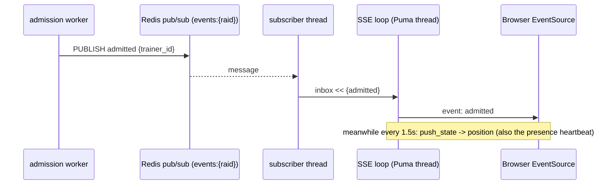

# Chapter 4: Real-Time Updates (SSE) & the Claim Window

A waiting queue is miserable if you have to refresh to learn your place. This chapter covers how the
server *pushes* position and admission to the browser over **Server-Sent Events**, and the
**per-trainer claim window** that produces the "You're up! 0:29 to claim" countdown. The headline
design idea: a Redis pub/sub fast-path for instant admission, with a periodic poll as a
self-healing fallback — belt and suspenders.

## Why SSE, not WebSocket

Queue status is purely server → client. The browser never needs to *send* anything over the live
channel — it joins and claims over plain REST. SSE fits that exactly and is cheaper than WebSocket.

| Transport | Direction | Fit here |
|-----------|-----------|----------|
| Server-Sent Events (chosen) | server → client only | Perfect; browser `EventSource` auto-reconnects |
| WebSocket / ActionCable | bidirectional | Overkill; more machinery for a channel we'd only use one way |
| Polling | client pull | Defeats the purpose; amplifies load (the very thing the queue exists to tame) |

The honest trade-off, documented in the plan: each SSE stream holds a Puma thread, so a single dev
server caps at its thread count. Scaling to a true stateless SSE fleet is deferred (Chapter 8). The
load simulator works around this by mostly polling (Chapter 7).

## The streaming controller

[`QueueStreamsController`](../backend/app/controllers/queue_streams_controller.rb) mixes in
`ActionController::Live` and runs a loop that blends two event sources:

```ruby
# backend/app/controllers/queue_streams_controller.rb:8
def show
  raid = Raid.find(params[:raid_id])
  trainer = resolve_trainer
  return render_error(:not_found, "gone", ...) unless trainer

  setup_sse_headers
  sse = ActionController::Live::SSE.new(response.stream)
  inbox = Thread::Queue.new
  subscriber = start_subscriber(raid.id, trainer.id, inbox)   # Redis SUBSCRIBE in a thread
  interval = QueueConfig::POSITION_PUSH_MS / 1000.0

  return if push_state(sse, raid.id, trainer.id) == :stop     # send current state immediately

  loop do
    event = inbox.pop(timeout: interval)                      # nil on timeout → periodic tick
    if event
      sse.write(event[:data], event: event[:name])
      break if terminal?(event[:name])                        # admitted / raid_full ends the stream
    elsif push_state(sse, raid.id, trainer.id) == :stop
      break
    end
  end
rescue ActionController::Live::ClientDisconnected, IOError
ensure
  subscriber&.kill
  sse&.close
end
```

The pattern to understand is `Thread::Queue#pop(timeout:)`. A background thread runs a blocking Redis
`SUBSCRIBE` and pushes only *this trainer's* events into `inbox`:

```ruby
# backend/app/controllers/queue_streams_controller.rb:51
def start_subscriber(raid_id, trainer_id, inbox)
  Thread.new do
    redis = QueueRedis.dedicated                       # a connection NOT from the pool
    redis.subscribe(QueueConfig.events_channel(raid_id)) do |on|
      on.message do |_channel, payload|
        msg = JSON.parse(payload)
        next unless msg["trainer_id"].to_s == trainer_id.to_s
        inbox << { name: msg["event"], data: msg["data"] }
      end
    end
  ensure
    redis&.close
  end
end
```

Note `QueueRedis.dedicated` ([`queue_redis.rb:23`](../backend/app/services/queue_redis.rb#L23)) — a
`SUBSCRIBE`d connection is blocked for its whole life and must not return to the shared
`ConnectionPool`, so subscribers get their own connection while everything else borrows from the
pool.

## The hybrid: instant push + healing poll

The loop body is the clever bit. Two ways an `admitted` can reach the trainer:

- **Fast path:** the worker `PUBLISH`es `admitted` → the subscriber thread drops it in `inbox` →
  `inbox.pop` returns it immediately → SSE writes it. Latency ~milliseconds.
- **Fallback:** if the message is ever missed (subscriber attaching late, a dropped publish),
  `inbox.pop(timeout: interval)` returns `nil` after `POSITION_PUSH_MS` (1.5s), and `push_state`
  recomputes the trainer's state directly from Redis — catching the admission within ~1.5s anyway.

`push_state` doubles as the position emitter and the keepalive:

```ruby
# backend/app/controllers/queue_streams_controller.rb:70
def push_state(sse, raid_id, trainer_id)
  result = RaidQueue::Position.call(raid_id:, trainer_id:)
  if result.ok? && result.data[:state] == "waiting"
    QueueRedis.with { |r| r.set(QueueConfig.presence_key(raid_id, trainer_id), "1", ex: ...) }  # heartbeat!
    sse.write({ position: result.data[:position], depth: result.data[:depth] }, event: "position")
    :continue
  elsif result.data[:state] == "admitted"
    sse.write({ raid_id:, claim_seconds_remaining: result.data[:claim_seconds_remaining] }, event: "admitted")
    :stop
  else
    sse.write({ error: "gone" }, event: "raid_full"); :stop
  end
end
```

That `r.set(presence_key, ...)` is the heartbeat from Chapter 2 — **an open SSE connection is what
keeps your place alive.** Walk one waiting trainer through ~3 seconds:

```
t      inbox.pop result        action                          SSE bytes sent to browser
-----  ----------------------  ------------------------------  --------------------------------
0.00   (initial push_state)    waiting, rank 4213              event: position\ndata: {"position":4213,...}
1.50   nil (timeout)           push_state -> still waiting     event: position\ndata: {"position":4187,...}
3.00   nil (timeout)           push_state -> still waiting     event: position\ndata: {"position":4150,...}
3.40   {admitted} from worker  write + break                   event: admitted\ndata: {"claim_seconds_remaining":120}
```

Notice the `admitted` arrived at 3.40 between ticks — pushed instantly, not waited-for. If the
publish had been lost, the 4.50 tick's `push_state` would have caught it from the `claimable` TTL.



Caption: two arrows into the SSE loop — the pub/sub fast path (top) and the periodic `push_state`
(note) — converge on the same `sse.write`.

## The claim window

When the worker admits someone it writes `claimable:{raid}:{trainer}` with a TTL of
`CLAIM_WINDOW_SECONDS` (default 120). That key is three things at once:

- the **gate** for claiming — `Reservations::Claim#admitted?` checks `r.exists?` on it.
- the **countdown** — `Position` returns `claim_seconds_remaining` from the key's `TTL`.
- the **forfeit timer** — when it expires, the claim gate fails (`:not_admitted`), so an AFK trainer
  simply loses the hold. (In elastic encounters, that freed slot is backfilled — Chapter 5.)

The slot is never *reserved* at admission, so a no-show costs the system nothing — the slot was only
ever decremented at claim time (Chapter 3).

## The browser side

[`frontend/lib/queueStream.ts`](../frontend/lib/queueStream.ts) is a thin `EventSource` wrapper that
closes the stream on a terminal event so the browser doesn't auto-reconnect into a finished queue:

```ts
es.addEventListener("admitted", (e) => {
  handlers.onAdmitted?.(JSON.parse((e as MessageEvent).data));
  es.close();  // terminal — stop EventSource from reconnecting
});
```

The waiting-room page [`frontend/app/raids/[id]/page.tsx`](../frontend/app/raids/[id]/page.tsx) opens
that stream while `phase === "waiting"`, drives a local 1-second countdown from
`claim_seconds_remaining`, and flips through `idle → waiting → admitted → confirmed/expired`. The
position counter updates live; no polling.

## Try it out

Try each step yourself first — expand the solution only when stuck. These need the API and worker
running (Chapter 1).

1. Watch a raw SSE stream with `curl`. Join, then stream, and see `position` then `admitted`.

   <details>
   <summary><b>Solution</b></summary>

   ```bash
   B=localhost:3000
   TOKEN=$(curl -s -XPOST $B/raids/1/queue/join -H 'content-type: application/json' \
     -d '{"trainer_handle":"sse_demo"}' | ruby -rjson -e 'puts JSON.parse(STDIN.read)["token"]')
   curl -sN --max-time 4 "$B/raids/1/queue/stream?token=$TOKEN"
   ```

   Expected (worker running): `event: position` lines, then within ~1s `event: admitted` with
   `claim_seconds_remaining`. The `-N` disables curl buffering so you see events as they arrive.
   </details>

2. Confirm the claim window is the gate: claim after deleting the claimable key.

   <details>
   <summary><b>Solution</b></summary>

   ```bash
   cd backend && bin/rails runner '
     raid = Raid.create!(boss:"X", gym_name:"G", starts_at:1.hour.from_now, capacity:5, slots_remaining:5, status:"published")
     t = Trainer.find_or_create_by_handle!("late")
     QueueRedis.with { |r| r.set(QueueConfig.claimable_key(raid.id,t.id),"1",ex:30) }
     p Reservations::Claim.call(raid:, trainer:t).code        # :created
     # admitted flag cleared by the claim; reservation now exists -> idempotent replay:
     p Reservations::Claim.call(raid:, trainer:t).data[:idempotent]   # true'
   ```

   Expected: `:created` then `true`. The first claim consumed the window; the replay returns the
   existing reservation (idempotency-first ordering from Chapter 3), not `:not_admitted`.
   </details>

3. Shorten the position cadence and observe more frequent ticks. Set `POSITION_PUSH_MS=500` for the
   server, restart it, and re-run exercise 1.

   <details>
   <summary><b>Solution</b></summary>

   ```bash
   cd backend && POSITION_PUSH_MS=500 bin/rails server -p 3000
   ```

   Re-run the curl from exercise 1: you'll see `position` events roughly twice as often. The value
   is read in [`queue_config.rb`](../backend/config/initializers/queue_config.rb#L10) and used as the
   `inbox.pop` timeout — it's both the poll cadence and the keepalive interval, so don't set it above
   your proxy's idle timeout.
   </details>

So far we've followed the original fixed-capacity model: one raid, N slots, queue, claim. Chapter 5
takes the more interesting product turn — **elastic encounters**, where trainers queue for a Pokémon
and the system spawns rooms on demand and backfills no-show slots, all while reusing the exact
no-oversell claim you just learned.
