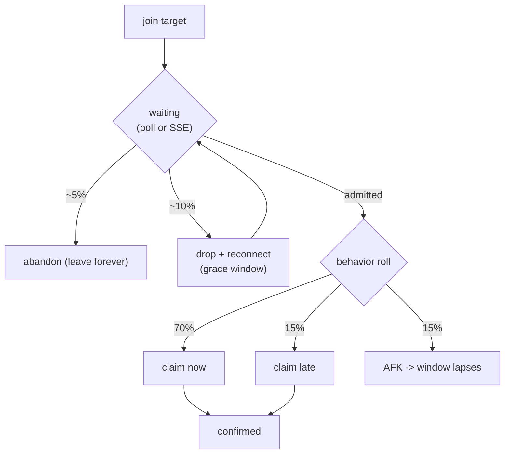

# Chapter 7: Load Simulation

Unit tests prove correctness with ~40 threads (Chapter 6). But "does it behave like a real queue
when thousands of people pile in, some claim, some go AFK, some rage-quit?" is a different question.
[`backend/sim/simulate.rb`](../backend/sim/simulate.rb) answers it: thousands of **fiber-based
virtual trainers** driving the *real HTTP API*, with realistic behavior, live stats, and a
no-oversell integrity check against live metrics. This chapter is about why fibers, how a virtual
trainer behaves, and how to drive it.

## Why fibers, not threads or jobs

A virtual trainer is a long-lived, IO-bound session: join, wait minutes, react, maybe reconnect.
You want thousands concurrently. The concurrency model matters:

| Model | Cost at 2,000 concurrent | Verdict |
|-------|--------------------------|---------|
| Background jobs (Sidekiq/ActiveJob) | bounded worker pool; long-lived sessions clog it | wrong tool |
| OS threads | ~heavy past a few hundred (stacks, GVL contention) | doesn't scale |
| Fibers (`async` gem) | thousands cheaply; non-blocking IO via a fiber scheduler | chosen |

The simulator uses the [`async`](https://github.com/socketry/async) and `async-http` gems (in a
`:sim` Gemfile group). One reactor thread runs thousands of fibers; while one fiber waits on a
socket, others run. That's how a single process can model 2,000 trainers on a laptop.

## A virtual trainer's lifecycle

Each fiber runs [`run_trainer`](../backend/sim/simulate.rb) — join, wait, then a behavior roll:

```ruby
# backend/sim/simulate.rb  (decide_claim)
roll = rand
if roll < 0.70
  sleep(rand(0.2..2.0))                 # claim promptly
elsif roll < 0.85
  sleep(rand(4.0..[window - 3, 5].max)) # claim late, still within the window
else
  sleep(window + rand(2.0..5.0))        # AFK past the window -> hold lapses
  stat(:expired_afk); return
end
# claim is the SAME endpoint in both modes: POST /raids/:room_or_raid_id/reservations
```

While waiting, two more behaviors fire (`wait_via_poll`): ~5% **abandon** the line forever, ~10%
**drop and reconnect** mid-wait (exercising the Chapter 2 grace window). A handful hold real SSE
connections (`wait_via_sse`); the rest poll status, because SSE doesn't scale to thousands on one
dev server (Chapter 4's documented limit).



Caption: the percentages here are the literal `rand` thresholds in `decide_claim`/`wait_via_poll` —
this is the load shape the sim generates.

## One simulator, two modes

`SIM_MODE` switches between the two product models. The claim is *identical* in both (the room is a
`Raid`), so only seeding and the join/status URLs differ:

```ruby
# backend/sim/simulate.rb
def base_path(id) = ENCOUNTERS ? "/encounters/#{id}" : "/raids/#{id}"
def claim_target(status_body, target) = ENCOUNTERS ? status_body["room_id"] : target
```

In encounter mode the sim watches rooms spawn and backfill (Chapter 5); in raid mode it watches the
last-slot contention (Chapter 3).

## Bounded concurrency and the integrity check

Two production-minded details. First, an `Async::Semaphore` caps in-flight HTTP requests
(`SIM_CONCURRENCY`, default 200) so the sim models bounded server concurrency rather than DDoSing
Puma. Second, after every run it independently verifies the headline guarantee against live
`/metrics`:

```ruby
# backend/sim/simulate.rb (orchestration tail)
RUN[:targets].each do |id|
  # ... read /raids/:id/metrics or /encounters/:id/metrics
  claimed_total += confirmed_for(id)
  oversold << id if any_room_over_capacity?(id)
end
ok = oversold.empty? && claimed_total == STATS[:confirmed]
puts ok ? "  ✅ NO OVERSELL" : "  ❌ MISMATCH — investigate!"
```

A real 2,000-trainer run: `accounted 2000/2000`, `errors 0`, `p95 31ms`, and `slots consumed ==
confirmed claims` with zero oversold raids. The same guarantee the unit tests assert, re-checked
end-to-end under load.

## Driving it: rake profiles

[`lib/tasks/sim.rake`](../backend/lib/tasks/sim.rake) wraps the ENV knobs in named profiles so you
don't memorize them:

```bash
cd backend
bundle exec rake sim:reset         # wipe encounters/raids/reservations + Redis
bundle exec rake sim:fast          # ~2000 trainers, default (fast) admission
bundle exec rake sim:queue_heavy   # deep, sustained lines (admission throttled)
bundle exec rake sim:encounters    # elastic mode: watch rooms spawn + backfill
```

Each profile presets `SIM_*` vars, and any var you set yourself still wins
(`SIM_TRAINERS=500 bundle exec rake sim:queue_heavy`). The `queue_heavy`/`encounters` profiles set
`SIM_ADMISSION_RATE`, which the sim writes to the `admission:rate:{id}` control-plane key from
Chapter 3 — throttling admission so lines build deep enough to actually watch.

## The "queue behind a crowd" tool

A subtle gotcha: an *unthrottled, empty* encounter admits you instantly (default batch 50/tick), so
you never see a line. To experience being #150, you need waiters *ahead* of you and slow admission.
`sim:prefill` stages exactly that:

```ruby
# backend/lib/tasks/sim.rake  (sim:prefill)
enc = Encounter.create!(..., status: "draft")
QueueRedis.with { |r| r.set(QueueConfig.enc_admission_rate_key(enc.id), rate) }  # throttle BEFORE publish
enc.update!(status: "published")
count.times { |i| Encounters::Join.call(encounter: enc, trainer: Trainer.find_or_create_by_handle!("waiter_#{i}_#{SecureRandom.hex(3)}")) }
```

Order matters: throttle the admission rate *before* publishing, or the worker drains the line at the
default batch before you can join. Then `bundle exec rake "sim:prefill[400,2]"` leaves ~400 waiters
draining at 2/sec — join the printed URL and watch your position tick down.

## Try it out

Try each step yourself first — expand the solution only when stuck. These need the API + worker
running (Chapter 1); the sim gems install via `bundle install` (the `:sim` group).

1. Run a small fast-mode simulation directly and read the summary.

   <details>
   <summary><b>Solution</b></summary>

   ```bash
   cd backend && SIM_TRAINERS=150 SIM_RAIDS=8 SIM_DURATION=6 SIM_CONCURRENCY=60 \
     bundle exec ruby sim/simulate.rb
   ```

   Expected: a per-second table, then a SUMMARY with `accounted 150 / 150 trainers`, `errors 0`, and
   an INTEGRITY block ending `✅ NO OVERSELL`. The accounting (every trainer reaches a terminal
   state) is the sim's internal consistency check.
   </details>

2. Run elastic mode and watch rooms spawn in the operator UI.

   <details>
   <summary><b>Solution</b></summary>

   ```bash
   cd backend && bundle exec rake sim:encounters
   ```

   While it runs, open `http://localhost:3003/encounters/<id>/metrics` (the sim prints/creates
   encounters; pick one from `http://localhost:3003/encounters`). You'll see the room count climb and
   per-room fill bars move — the Chapter 5 spawn/backfill logic under load.
   </details>

3. Stage a deep queue and join behind it yourself.

   <details>
   <summary><b>Solution</b></summary>

   ```bash
   cd backend && bundle exec rake sim:reset && bundle exec rake "sim:prefill[400,2]"
   ```

   It prints a URL like `http://localhost:3003/encounters/12`. Open it (frontend + worker running):
   you'll start around `#400` and watch the position count down ~2/sec as the throttled worker
   admits the waiters ahead of you — the Chapter 4 live position, fed by a Chapter 7 crowd.
   </details>

The sim drives the system as a black box over HTTP — which is exactly how it runs in production.
Chapter 8 covers that last mile: the five processes, docker-compose, the tuning knobs that decide
whether you're testing the system or just testing Puma's thread count, and what's deliberately left
for a future infrastructure phase.
