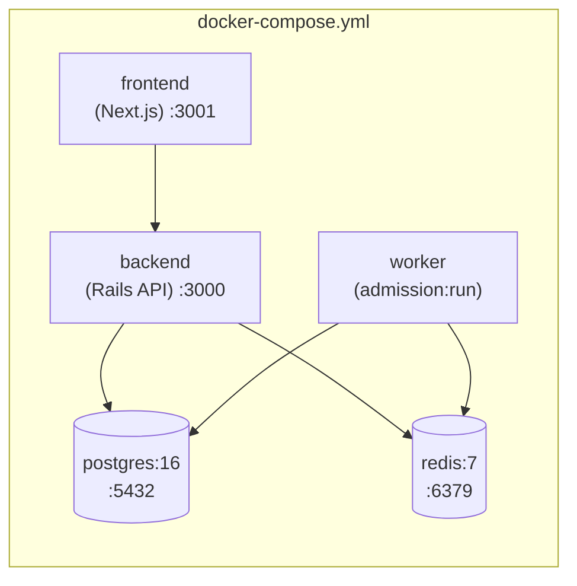

# Chapter 8: Deployment, Processes & Tuning

You've read every code path. This last chapter is the operational reality: the five processes that
make up a running system, how `docker-compose` wires them, the tuning knobs that decide whether
you're load-testing the real system or just Puma's thread count, and what's deliberately left for a
future infrastructure phase. The project is **local-first by mandate** — the constitution requires
the whole thing to run via `docker-compose`, with AWS explicitly deferred.

## Five processes, three of them in the hot path



Caption: `backend` and `worker` build from the *same* image but run different commands — the worker
is `bin/rails admission:run`, the API is `bin/rails server`. Splitting them is concept #4 (control
vs data plane) at the deployment layer: you can restart or scale the worker without touching the API.

The compose file ([`docker-compose.yml`](../docker-compose.yml)) makes the dependency order explicit
with healthchecks — the backend waits for Postgres and Redis to be `healthy`, the worker waits for
the backend:

```yaml
# docker-compose.yml
backend:
  build: ./backend
  command: bash -c "bin/rails db:prepare && bin/rails server -b 0.0.0.0 -p 3000"
  environment:
    PGHOST: postgres
    REDIS_URL: redis://redis:6379/0
  depends_on:
    postgres: { condition: service_healthy }
    redis:    { condition: service_healthy }
worker:
  build: ./backend
  command: bash -c "bin/rails admission:run"
  depends_on:
    backend: { condition: service_started }
```

`bin/rails db:prepare` on the backend's first boot creates, migrates, and seeds — idempotent, so
restarts are safe.

```bash
docker compose up --build      # frontend :3001, API :3000
```

## Configuration is all environment variables

Two files turn env into config. [`config/database.yml`](../backend/config/database.yml) reads
`PGHOST`/`PGUSER`/`PGPASSWORD` (so the same image runs against a Unix socket in local dev and a
networked Postgres in compose), and every tuning parameter lives in
[`config/initializers/queue_config.rb`](../backend/config/initializers/queue_config.rb#L6):

| Var | Default | Effect |
|-----|---------|--------|
| `RECONNECT_GRACE_SECONDS` | 120 | how long a place is held across a disconnect (Chapter 2) |
| `CLAIM_WINDOW_SECONDS` | 120 | how long an admitted trainer has to claim (Chapter 4) |
| `ADMISSION_DEFAULT_BATCH` | 50 | fallback admit-per-tick when no `admission:rate` key (Chapter 3) |
| `ADMISSION_TICK_MS` | 1000 | worker loop interval |
| `POSITION_PUSH_MS` | 1500 | SSE position cadence + keepalive (Chapter 4) |
| `RAILS_MAX_THREADS` | 5 | Puma threads **and** the DB pool size |
| `REDIS_POOL_SIZE` | 25 | Redis connection pool ([`queue_redis.rb:10`](../backend/app/services/queue_redis.rb#L10)) |

These are initializer constants, so changing one requires a process restart (initializers don't
hot-reload — a gotcha that bites during local experimentation).

## The tuning that actually matters: threads vs. SSE

The single most important operational fact: **each open SSE stream holds a Puma thread for its
entire life** (Chapter 4). So if you run the load simulator with SSE clients, do the arithmetic:

```
RAILS_MAX_THREADS = 64
SSE clients held   = 20      -> 20 threads parked on open streams
threads left for everything = 44   -> serves all the polling join/claim/status traffic
```

If you set `RAILS_MAX_THREADS=8` and open 20 SSE streams, you've deadlocked yourself — zero threads
left for actual requests. And because the DB pool is wired to `RAILS_MAX_THREADS` in
`database.yml`, the same number sizes both. The simulator runs (Chapter 7) therefore boot the backend
tuned:

```bash
cd backend
RAILS_MAX_THREADS=64 REDIS_POOL_SIZE=80 CLAIM_WINDOW_SECONDS=12 ADMISSION_TICK_MS=500 \
  bin/rails server -p 3002
```

Without that, a 2,000-trainer run measures Puma's 5-thread default, not the system. This is the kind
of environment note that's the difference between a meaningful load test and a misleading one.

## Local dev quirk: ports already in use

On a typical dev box, the default ports (5432, 6379, 3000, 3001) are often occupied by a host
Postgres, a Redis container, and other dev servers. A plain `docker compose up` then fails with bind
conflicts. The fix is a throwaway override file that remaps the *host* ports (the in-container ports
stay the same, so service-to-service URLs are unchanged), using Compose's `!override` tag because
Compose otherwise *merges* port lists:

```yaml
# /tmp/ports.override.yml
services:
  postgres: { ports: !override ["5433:5432"] }
  redis:    { ports: !override ["6380:6379"] }
  backend:  { ports: !override ["3010:3000"] }
  frontend: { ports: !override ["3011:3001"] }
```

```bash
docker compose -f docker-compose.yml -f /tmp/ports.override.yml up
```

## What's deferred, and the intended AWS shape

[`infra/`](../infra/README.md) is a deliberate placeholder — no Terraform yet. The constitution lists
the deferred items so they're honest, not forgotten:

| Component | Intended AWS target |
|-----------|---------------------|
| Rails API + SSE fleet | ECS/Fargate behind an ALB (stateless; horizontal SSE) |
| Admission worker | a separate ECS/Fargate service (control/data-plane split) |
| Redis | ElastiCache (cluster mode + replicas for failover) |
| PostgreSQL | RDS (Multi-AZ) |

Also deferred: the adaptive admission *controller* that would write `admission:rate` (the worker
already reads it — Chapter 3), section-based pub/sub seat maps, and a durable recovery log to rebuild
queue state after Redis loss. The seams exist; the implementations are future work. The reason this
is acceptable: losing Redis loses *positions*, never *reservations* (concept #1), so a recovery log
is an optimization, not a correctness requirement.

## The honest scaling boundary

This iteration is validated for *correctness and real-time behavior at representative scale on one
machine* — thousands queued, proven no-oversell (Chapters 6–7). The north-star design target is
millions, and the architecture is shaped for it (O(log N) queue ops, batched admission, stateless
SSE), but the production-scale SSE fleet and managed infra are the next phase, not this one. Knowing
exactly where the validated boundary is — and saying so — is part of the design discipline.

## Try it out

Try each step yourself first — expand the solution only when stuck.

1. Bring up the full stack in Docker and watch the dependency order.

   <details>
   <summary><b>Solution</b></summary>

   ```bash
   docker compose up --build
   ```

   Watch the logs: `postgres` and `redis` report healthy, then `backend` runs `db:prepare` and
   boots, then `worker` and `frontend` start. If ports conflict, use the override file from the
   "ports" section. Visit `http://localhost:3001`.
   </details>

2. Prove the initializer-restart gotcha: change the claim window and confirm it needs a restart.

   <details>
   <summary><b>Solution</b></summary>

   ```bash
   cd backend && CLAIM_WINDOW_SECONDS=15 bin/rails runner 'puts QueueConfig::CLAIM_WINDOW_SECONDS'
   ```

   Prints `15`. Now start a server *without* the env var, set it later in your shell, and note the
   running server still uses the value from its boot. Constants are frozen at load — to change
   `CLAIM_WINDOW_SECONDS` for a running server you must restart it with the new env. This is why the
   sim runs always set tuning vars on the launch command.
   </details>

3. Demonstrate the threads-vs-SSE limit. Boot the API with a tiny thread count and open more SSE
   streams than threads.

   <details>
   <summary><b>Solution</b></summary>

   ```bash
   cd backend && RAILS_MAX_THREADS=3 bin/rails server -p 3000
   # in another shell, open 3 streams in the background, then try a normal request:
   for i in 1 2 3; do (curl -sN "localhost:3000/raids/1/queue/stream?token=t$i" &) ; done
   time curl -s -o /dev/null -w '%{http_code}\n' localhost:3000/raids
   ```

   With only 3 threads consumed by streams, the plain `GET /raids` hangs or is slow — every SSE
   connection holds a thread. Bump `RAILS_MAX_THREADS` and it's instant. That arithmetic is the
   whole reason the SSE fleet is the deferred scaling phase.
   </details>

That's the system end to end — from a Redis sorted set holding the line, through the Postgres
transaction that makes overselling impossible, to real-time SSE, elastic rooms, a thread-true test
suite, a fiber-driven load harness, and the processes that run it all. Re-read Chapter 1's four
concepts now; every file you've seen since is one of them made concrete.
